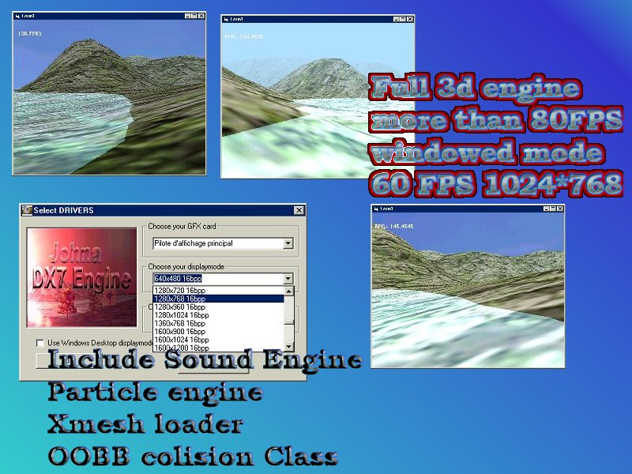



## JohnaDX7 3d engine with full source code

### Description

This is a full 3d engine with great landscape engine ,cool AABB colision detection,great particle engine,cool camera action...

Now the full source code is include

i'm waiting for your feedbacks

and vote for it if u like it

i want to port it to DirectX8 but i need feedbacks for improve somes method

Please Leave feedbacks and vote for it..

I'm sorry i cannot upload my zipFile

DOWLOAD IT AT THIS LINK http://perso.wanadoo.fr/malakoff/johna_DX7engine.zip

PLEAZE VOTE

Now this code can Fully be compiled

all bugs fixed....

VOTE it.
 
### More Info
 

             |
---                |---
**Submitted On**   |2002-03-23 23:47:26
**By**             |[polaris](https://github.com/Planet-Source-Code/PSCIndex/blob/master/ByAuthor/polaris.md)
**Level**          |Advanced
**User Rating**    |5.0 (105 globes from 21 users)
**Compatibility**  |VB 4\.0 \(32\-bit\), VB 5\.0, VB 6\.0
**Category**       |[DirectX](https://github.com/Planet-Source-Code/PSCIndex/blob/master/ByCategory/directx__1-44.md)
**World**          |[Visual Basic](https://github.com/Planet-Source-Code/PSCIndex/blob/master/ByWorld/visual-basic.md)
**Archive File**   |[JohnaDX7\_3665233292002\.zip](https://github.com/Planet-Source-Code/polaris-johnadx7-3d-engine-with-full-source-code__1-33002/archive/master.zip)

